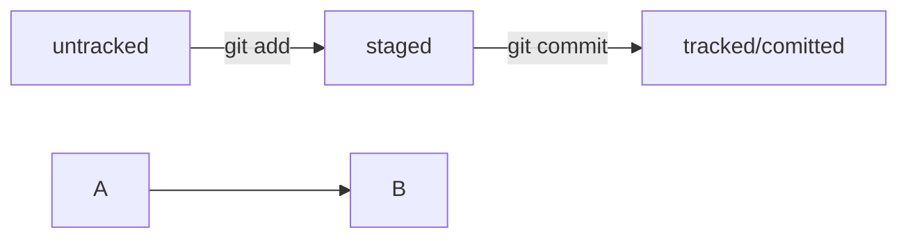

# PRACTICE 1
---
## README
---

```bash
mkdir foldername
cd foldername
git init # Инициализация репозитория, создание папки .git
git remote add origin repourl # Связывание локального и удалённого репозитория
git remote -v # Просмотр информации и связи локального репозитория с удалённым
touch filename.extention
vim filename.extension
git status # Просмотр изменений репозитория
git status --ignored # Просмотр изменений репозитория с включением игнорируемых файлов
git add filename.extension # Добавление файла в staging коммита
git commit -m "some message" # Создание коммита
git push -u origin master # Отправка изменений в удалённый репозиоорий с указанием соответствия веток
git log # Просмотр подробного списка коммитов репозитория
git log --oneline # Просмотр упрощённого списка коммитов репозитория
git commit --amend --no-edit # Дополнение последнего коммита без изменения комментария
git commit --amend -m "Новый комментарий" # Дополнение последнего коммита с изменением комментария
git restore --staged filename # Удаление файла из staging раздела
git restore --staged . # Удаление всех файлов из staging раздела
git reset --hard commit_hash # Откат состояния репозитория до указанного коммита
git restore filename # Откат изменений файла до состояния последнего коммита или состояния файла в staging разделе
git diff # Просмотр изменений текущего состояния репозитория в сравнении с последним коммитом
git diff --staged # Просмотр изменений состояния файлов в staging разделе в сравнении с последним коммитом
git diff commit_hash commit_hash # Просмотр изменений между коммитами
git clone giturl # Клонирование удалённого репозитория в локальное хранилище
```



## .gitignore
```
# Комментарий
# Игнорирование всех файлов репозитория
*
**
# Игнорирование всех файлов репозитория с конкретным названием
filename.ext
# Игнорирование всех файлов с конкретным названием в корне репозитория
/filename.ext
# Игнорирование всех файлов в кокретной папке
dirname/
# Игнорирование файлов с именем по шаблону с одним любым символом на месте знака ?
filename?.ext
# Игнорирование файлов с именем по шаблону с любым количеством символов на месте знака *
*.ext
# Игнорирование файлов с именем по шаблону с подстановкой символа из заданного списка
filename[123].ext
filename[a-z].ext
# Игнорирование файлов с одним уровнем вложенности в любой папке, включая нулевой
dirname/*/filename.ext
# Игнорирование файлов с любым уровнем вложенности, включая нулевой
/dirname/**/filename.ext
# Исключение из правил игнорирования
!filename.ext

```
