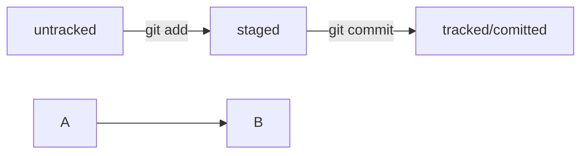

# PRACTICE 1
---
## README
---

```bash
mkdir foldername
cd foldername
git init # Инициализация репозитория, создание папки .git
git remote add origin repourl # Связывание локального и удалённого репозитория
touch filename.extention
vim filename.extension
git status # Просмотр изменений репозитория
git add filename.extension # Добавление файла в staging коммита
git commit -m "some message" # Создание коммита
git push -u origin master # Отправка изменений в удалённый репозиоорий с указанием соответствия веток
git log # Просмотр подробного списка коммитов репозитория
git log --oneline # Просмотр упрощённого списка коммитов репозитория
git commit --amend --no-edit # Дополнение последнего коммита без изменения комментария
git commit --amend -m "Новый комментарий" # Дополнение последнего коммита с изменением комментария
```



