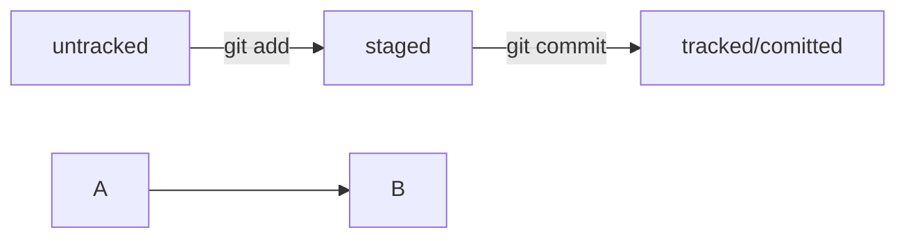

# PRACTICE 1
---
## README
---

```bash
mkdir foldername
cd foldername
git init
git remote add origin repourl
touch filename.extention
vim filename.extension
git add filename.extension
git commit -m "some message"
git push -u origin master
git log
git log --oneline
```



